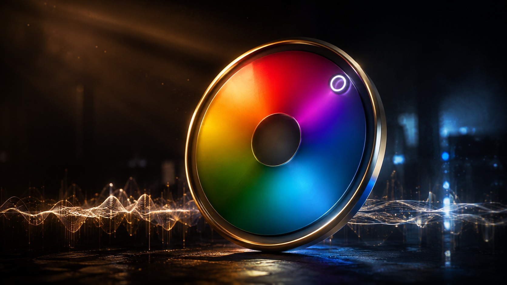
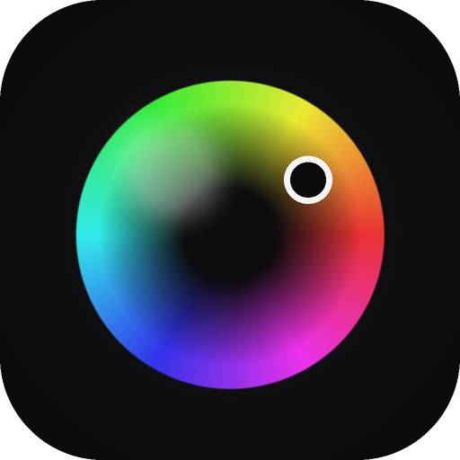
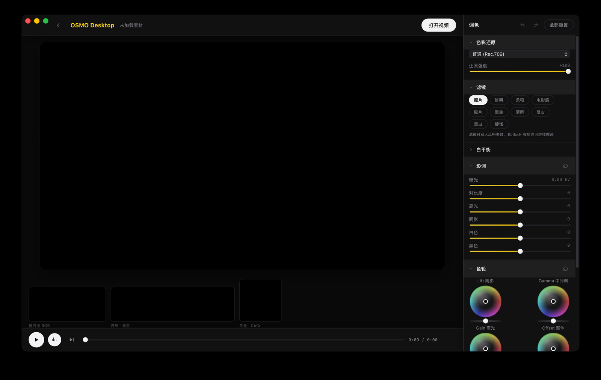
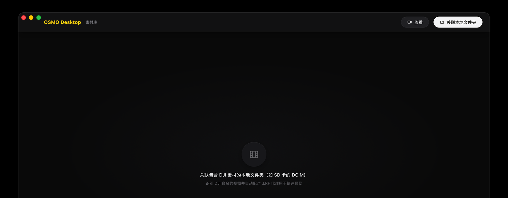
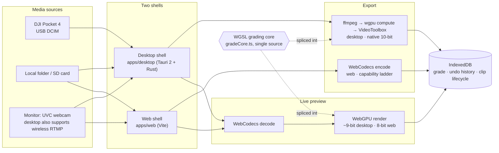

<a id="readme-top"></a>

<p align="right">English · <a href="README.md">简体中文</a></p>

<p align="center">
  
</p>

<p align="center">
  
</p>

<h3 align="center">OSMO Desktop</h3>

<p align="center">
  A desktop DJI Mimo — a media library, professional color grading, and native 10-bit export workstation built for the DJI Pocket 4.
  <br />
  <a href="#get-started"><strong>Get Started</strong></a>
  ·
  <a href="#feature-map"><strong>Features</strong></a>
  ·
  <a href="#architecture"><strong>Architecture</strong></a>
  ·
  <a href="#verified-on-hardware"><strong>Verified on hardware</strong></a>
  ·
  <a href="#known-limitations"><strong>Known limitations</strong></a>
</p>

<p align="center">
  
  
  
  
  
  <a href="https://github.com/zzw4257/osmo-desktop/actions/workflows/ci.yml"></a>
</p>

One codebase, two shells: a **Tauri 2 desktop app** and a **web app**, sharing a single source of color math — the same WGSL runs the live preview, the web export, and the native desktop export, so preview and export always produce the same result.

<p align="center">
  
  <br/><sub>Grading panel — color restoration / filters / tone / four color wheels / curves / 8-band HSL, all reflected live in the viewer and the triple scope readout.</sub>
</p>

<p align="center">
  
  <br/><sub>Library — link an SD card or local folder and DJI-named clips are recognized automatically; the association survives a restart.</sub>
</p>

## Why this exists

DJI Mimo's mobile grading is a handful of sliders; professional NLEs (Resolve/Premiere) don't know the Pocket 4's official D-Log restoration formula, and none of them recognize "which Pocket 4 shot this" the moment you plug in a USB cable. OSMO Desktop fills that gap: **a desktop grading station that actually knows the Pocket 4**, beyond mobile Mimo — official D-Log math, real 10-bit export, scopes, and it recognizes your SD card.

## Feature map

| Area | Capabilities |
|---|---|
| Library | Link a local folder / SD card (restored on restart), DJI-clip recognition, LRF proxy thumbnails, shot time, graded/exported badges |
| Device | Plug-and-detect (DCIM fingerprint), one-click browse, safe multi-select delete (DCIM-scoped + size re-check + paired LRF) |
| Grading | Official D-Log formula restoration / D-Log M · D-Log 2 via LUT (adjustable strength), white balance, six-way tone controls, four color wheels, six curve channels, 8-band HSL, saturation/vibrance, split tone, fade, creative LUT, sharpen/denoise/grain, four-part vignette |
| Filters | 10 built-in presets (pure parameters, still tweakable after applying, never stack) |
| Scopes | RGB histogram / luma waveform / CbCr vectorscope (fully GPU, real-time) |
| Playback | 4K HEVC 10-bit hardware decode at 30fps, streaming demux (multi-GB files never fully load into memory), LRF proxy scrub, frame-step, persistent ⌘Z undo/redo |
| Export | Desktop: native ffmpeg⇄wgpu pipeline, **10-bit fidelity** (measured 877/939 gray levels); Web: WebCodecs capability ladder (HEVC→H.264) + lossless audio remux, with the actual codec tier labeled on the output |
| Monitor | Live feed from the camera's webcam mode → through the same grading pipeline + scopes = a field monitor with LUT preview (grade remembered per device) |
| Onboarding | A first-launch, step-by-step walkthrough (color wheel / connect device / D-Log color science / library preview) — every step is a miniature preview rendered from the app's real components |

## Get started

```bash
pnpm install
pnpm dev:web        # browser shell at localhost:5173 (Chrome/Edge has the most complete feature set)
pnpm dev:desktop    # Tauri desktop shell (needs the Rust toolchain + ffmpeg on PATH)
./tooling/scripts/gen-samples.sh   # generate 4K 10-bit test clips (needs ffmpeg)

# verify
pnpm typecheck && pnpm test               # TS (vitest)
(cd apps/desktop/src-tauri && cargo test --lib)   # Rust
pnpm build:web && pnpm build:desktop      # build both shells
```

Dev startup automatically runs a 10-bit precision probe; results print to the terminal as `[PROBE-RESULT]` (see [`docs/baselines.md`](docs/baselines.md)).

<details>
<summary><b>Verify native export headlessly</b></summary>

```bash
pnpm exec tsx tooling/scripts/gen-export-job.ts <src.mp4> <out.mp4> 3840 2160 30 dlog job.json 0.5
(cd apps/desktop/src-tauri && cargo run --bin export-cli -- job.json)
```

</details>

## Architecture

- **Single source of math**: color-grading math exists only in the WGSL core (`packages/color-engine/src/pipeline/gradeCore.ts`)
  and its TS packer; the preview fragment shader, the web export path, and the Rust native wgpu compute path all
  splice in the same WGSL — the Rust side carries zero grading math, only the TS-packed params/curve/LUT binary blob
- **Precision tiers** (measured, [`docs/baselines.md`](docs/baselines.md)): preview runs on WebCodecs+WebGPU (~9-bit on
  desktop, 8-bit on web); 10-bit-faithful export runs the native `ffmpeg decode → wgpu grade → VideoToolbox hardware encode` path
- **Package boundaries**: `platform` is the only TS package that touches the Tauri API (dynamically imported, zero pollution
  in the web bundle); `color-engine` only knows textures, never video sources; `media-pipeline` has no idea grading exists
- **Unified persistence**: one IndexedDB (identical shape on both shells) holds the grade, undo history, folder association, and clip lifecycle
- **Hardware decoder discipline**: decode sessions must be reused (VideoToolbox sessions are a finite resource); error paths recover automatically
- **UI material system**: `@osmo/ui` is driven by design tokens (`packages/ui/src/tokens.ts`) sampled pixel-for-pixel from real
  DJI Mimo App Store screenshots; controls follow macOS 26 Liquid Glass's concentric-radius and capsule-shape conventions,
  with a consistent skin across native controls (scrollbars, checkboxes, sliders)
- Design docs: [`docs/m2-export-design.md`](docs/m2-export-design.md) (export), [`docs/baselines.md`](docs/baselines.md) (platform capability baselines)



## Verified on hardware

The following checklist has been walked through end-to-end on a real Pocket 4 (both USB and webcam-mode monitoring):

- [x] USB connect → set the camera to "File Transfer" → the library pops up a device banner
- [x] Browse device clips: thumbnails / LRF badge / shot time are correct
- [x] One-click D-Log restoration (color profile → D-Log) visually matches the official look
- [x] 10-bit export → `ffprobe` reports `hevc/Main 10/yuv420p10le`, colors look correct in QuickTime
- [x] Multi-select delete of exported clips → confirmed cleaned up on the camera (including `.LRF`)
- [x] Camera switched to "webcam mode" → monitor mode (USB camera source) → live picture + waveform
- [x] Wireless monitoring: switch monitor mode to "wireless RTMP" → start → point mobile Mimo's live-stream at the URL → picture renders through the grading pipeline

## Known limitations

- First-time camera activation still requires the mobile Mimo app (a DJI requirement); the desktop app takes over day-to-day use after that
- Remote shooting control (start recording / change settings) needs reverse-engineering DJI's private BLE protocol; existing community work only covers the
  Pocket 3 — the architecture already has a `DeviceProtocol` slot reserved for this as a longer-term experiment
- The web shell has no File System Access API on Safari/Firefox, so it falls back to read-only import; HEVC 10-bit hardware
  encoding coverage on the web is low, so web export automatically downgrades and states the tier explicitly

## Repository layout

```
packages/   shared color-engine scopes media-pipeline device-core storage platform presets ui app
apps/       desktop(Tauri 2 + Rust: export/scan/device)  web(Vite)
tooling/    scripts(sample generation / export jobs)  tsconfig  vite
samples/    generated test clips (gitignored) + the fake-dcim test fixture
docs/       architecture and platform-capability baseline docs
```

## Tech stack

React 18 · TypeScript · Vite · Tauri 2 (Rust) · WebGPU / WGSL · WebCodecs · ffmpeg · IndexedDB · pnpm workspaces · Vitest

## License

[MIT](LICENSE)

<p align="right">(<a href="#readme-top">back to top</a>)</p>
