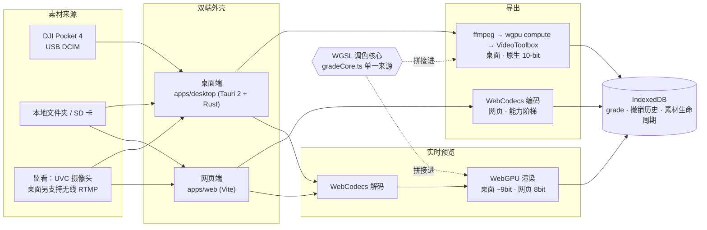

<a id="readme-top"></a>

<p align="right"><a href="README.en.md">English</a> · 简体中文</p>

<p align="center">
  
</p>

<p align="center">
  
</p>

<h3 align="center">OSMO Desktop</h3>

<p align="center">
  桌面版 DJI Mimo —— 为 DJI Pocket 4 打造的素材管理 + 专业调色 + 原生 10-bit 导出工作站。
  <br />
  <a href="#快速开始"><strong>快速开始</strong></a>
  ·
  <a href="#功能全景"><strong>功能</strong></a>
  ·
  <a href="#架构"><strong>架构</strong></a>
  ·
  <a href="#真机验证"><strong>真机验证</strong></a>
  ·
  <a href="#已知边界"><strong>已知边界</strong></a>
</p>

<p align="center">
  
  
  
  
  
  <a href="https://github.com/zzw4257/osmo-desktop/actions/workflows/ci.yml"></a>
</p>

一套代码双端发布：**Tauri 2 桌面应用** + **网页应用**，调色数学单一来源——同一段 WGSL 跑遍实时预览、网页导出与原生桌面导出，预览与导出用的永远是同一个结果。

<p align="center">
  
  <br/><sub>调色面板 —— 色彩还原 / 滤镜 / 影调 / 四路色轮 / 曲线 / HSL 分区，全部实时反映在左侧画面与右下角三联示波器上。</sub>
</p>

<p align="center">
  
  <br/><sub>素材库 —— 关联 SD 卡 / 本地文件夹后自动识别 DJI 命名素材，重启自动恢复关联。</sub>
</p>

## 为什么做这个

DJI Mimo 手机 App 的调色只有几根滑块；专业剪辑软件（Resolve/Premiere）不认识 Pocket 4 的 D-Log 官方还原公式，也没有"插上 USB 自动认出这是哪台 Pocket 4 拍的素材"这种细节。OSMO Desktop 想补的是这段空白：**手机 Mimo 之外，一个懂 Pocket 4 的桌面调色台**——官方 D-Log 数学、真 10-bit 导出、示波器、还认得你的 SD 卡。

## 功能全景

| 模块 | 能力 |
|---|---|
| 素材库 | 关联本地文件夹/SD 卡（重启自动恢复）、DJI 素材识别、LRF 代理缩略图、拍摄时间、已调色/已导出角标 |
| 设备 | 插入即检测（DCIM 指纹）、一键浏览、多选安全删除（DCIM 限定 + 大小复核 + LRF 联动） |
| 调色 | D-Log 官方公式还原 / D-Log M·D-Log 2 LUT 还原（强度可调）、白平衡、影调六件套、四路色轮、六种曲线、HSL 8 分区、饱和度/自然饱和度、分离色调、褪色、创意 LUT、锐化/降噪/颗粒、暗角四件套 |
| 滤镜 | 10 个内置预设（纯参数、套用后可继续微调、切换不叠加） |
| 示波器 | RGB 直方图 / 亮度波形 / CbCr 矢量（全 GPU，实时） |
| 播放 | 4K HEVC 10-bit 硬解 30fps、流式解封装（多 GB 文件不驻留内存）、LRF 代理 scrub、逐帧、⌘Z 撤销/重做（持久化） |
| 导出 | 桌面：ffmpeg⇄wgpu 原生管线 **10-bit 保真**（实测 877/939 灰阶）；网页：WebCodecs 能力阶梯（HEVC→H.264）+ 音频无损 remux，成片如实标注编码档位 |
| 监看 | 相机网络摄像头模式实时取流 → 调色管线 + 示波器 = 带 LUT 预览的现场监视器（按设备记忆调色） |
| 引导 | 首次启动的分步引导（色轮/连接设备/D-Log 色彩科学/素材库预览），每步都用应用真实组件渲染的微缩预览 |

## 快速开始

```bash
pnpm install
pnpm dev:web        # 浏览器端 localhost:5173（Chrome/Edge 功能最全）
pnpm dev:desktop    # Tauri 桌面端（需 Rust 工具链 + ffmpeg 在 PATH）
./tooling/scripts/gen-samples.sh   # 生成 4K 10-bit 测试样片（需 ffmpeg）

# 验证
pnpm typecheck && pnpm test               # TS（vitest）
(cd apps/desktop/src-tauri && cargo test --lib)   # Rust
pnpm build:web && pnpm build:desktop      # 双端产物
```

dev 启动自动运行 10-bit 精度探针，结果以 `[PROBE-RESULT]` 打到终端（详见 [`docs/baselines.md`](docs/baselines.md)）。

<details>
<summary><b>无 UI 验证原生导出</b></summary>

```bash
pnpm exec tsx tooling/scripts/gen-export-job.ts <src.mp4> <out.mp4> 3840 2160 30 dlog job.json 0.5
(cd apps/desktop/src-tauri && cargo run --bin export-cli -- job.json)
```

</details>

## 架构

- **单一数学源**：调色数学只存在于 WGSL 核心（`packages/color-engine/src/pipeline/gradeCore.ts`）
  与 TS 打包器；预览 fragment、网页导出、Rust 原生 wgpu compute 三个外壳拼接同一段 WGSL，
  Rust 侧零调色数学，只接收 TS 打包的 params/曲线/LUT 二进制 blob
- **精度分层**（实测，[`docs/baselines.md`](docs/baselines.md)）：预览走 WebCodecs+WebGPU（桌面 ~9bit / 网页 8bit），
  10-bit 保真导出走原生 `ffmpeg 解码 → wgpu 调色 → VideoToolbox 硬编`
- **包边界**：`platform` 是唯一接触 Tauri API 的 TS 包（动态导入，网页包零污染）；
  `color-engine` 只认纹理不认视频来源；`media-pipeline` 不知调色存在
- **统一持久化**：一个 IndexedDB（双端同构）承载 grade/撤销历史/文件夹关联/素材生命周期
- **硬解码器纪律**：解码会话必须复用（VideoToolbox 会话可耗尽），错误路径自动恢复
- **界面材质系统**：`@osmo/ui` 内部 design-token 驱动（`packages/ui/src/tokens.ts`），颜色取自真机 DJI Mimo App Store 截图像素采样，控件遵循 macOS 26 Liquid Glass 的同心圆角与胶囊形规范，滚动条/复选框/滑杆等原生控件统一皮肤
- 设计文档：[`docs/m2-export-design.md`](docs/m2-export-design.md)（导出）、[`docs/baselines.md`](docs/baselines.md)（平台能力基线）



## 真机验证

以下清单已在真实 Pocket 4 上逐条走通（USB 直连 + 网络摄像头两种模式）：

- [x] USB 连接 → 相机屏幕选「文件传输」→ 素材库弹出设备横幅
- [x] 浏览设备素材：缩略图 / LRF 徽标 / 拍摄时间正确
- [x] D-Log 素材一键还原（色彩还原选 D-Log）目视对齐官方效果
- [x] 导出 10-bit → ffprobe 为 `hevc/Main 10/yuv420p10le`，QuickTime 色彩正常
- [x] 已导出素材多选删除 → 相机上确认已清理（含 `.LRF`）
- [x] 相机切「网络摄像头」→ 监看模式（USB 摄像头源）→ 实时画面 + 波形
- [x] 无线监看：监看模式切「无线 RTMP」→ 开始 → 手机 Mimo 直播填推流地址 → 画面经调色管线显示

## 已知边界

- 首次激活相机必须用手机 Mimo（DJI 强制）；桌面端接管激活后的日常使用
- 遥控拍摄（开始录制/切参数）需 BLE 私有协议逆向，现有社区成果仅覆盖 Pocket 3 —— 架构已留
  `DeviceProtocol` 插槽，属远期实验项
- 网页端 Safari/Firefox 无 File System Access API，降级只读导入；HEVC 10-bit 网页硬编覆盖率低，
  网页导出自动降档并明示

## 目录结构

```
packages/   shared color-engine scopes media-pipeline device-core storage platform presets ui app
apps/       desktop(Tauri 2 + Rust: export/scan/device)  web(Vite)
tooling/    scripts(样片/导出任务)  tsconfig  vite
samples/    生成的测试样片（gitignored）+ fake-dcim 测试夹具
docs/       架构与平台能力基线文档
```

## 技术栈

React 18 · TypeScript · Vite · Tauri 2 (Rust) · WebGPU / WGSL · WebCodecs · ffmpeg · IndexedDB · pnpm workspaces · Vitest

## License

[MIT](LICENSE)

<p align="right">(<a href="#readme-top">回到顶部</a>)</p>
